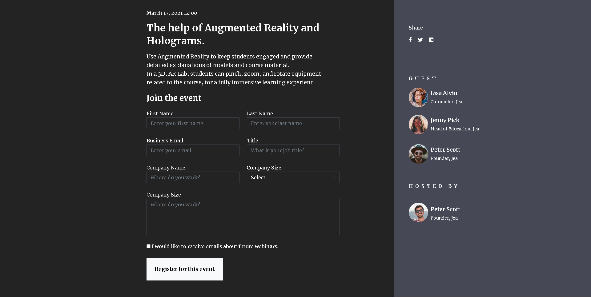

 # **Event-form Dökümanı**

### *Döküman Hakkında*

------------

### Html , Css ve Bootstrap 5.1 kullanılarak yazılmış bootstrap classlarına öncelik veren ve grid sistem  kullanılarak , bootstrap classlarını öğrenmeye başlayan yeni arkadaşlar için yapılan basit bir katılım formu dökümanıdır.

------------

### *Kullanılan Kütüphaneler*

------------

- Boostrap
- Font-awesome
- Google-Fonts

------------

### *Kütüphanelerin Kullanılması*

------------

- Boostrap kütüphanesini ister indirebilirsiniz istersenizde sitesi üzerinden hazır dokümantasyon dosyalarından boostrap css dosyasını `<head></head>` etiketleri içine kopyalayarak , javascript dosyasını ise `<body></body>` etiketinin en sonunda bulunacak şekilde yerleştirdikten sonra bootstrap kütüphanesini kullanabilirsiniz.
- [Bootstrap kütüphanesini projenize eklemek için tıklayınız](https://getbootstrap.com/docs/5.2/getting-started/introduction/ "Bootstrap kütüphanesini projenize eklemek için tıklayınız")

------------

1. Font-awesome kit code alarak kütüphaneyi projeye eklemek.
- Font-awesome kütüphanesine ister kendi sitesinden istersenizde cdnjs sitesinden son sürümünü projenize ekleyebilirsiniz.
- Kendi sitesinden projenize eklemek için email adresinizi girip size özel gönderilen kit  ile font awesome kütüphanesine erişim sağlayabilirsiniz.(Yalnızca free iconlar için)
- [Font-awesome kit bağlantısı almak için tıklayınız](https://fontawesome.com/start "Font-awesome kit bağlantısı almak için tıklayınız")
- Kit Code'unuzu aldıktan sonra bootstrap kütüphanesini eklediğimiz gibi `<head></head>` etiketleri arasına linki kopyalayıp kullanabilirsiniz.

------------

2.`cdnjs.com` üzerinden font-awesome kütüphanesini projeye eklemek
- `cdnjs` üzerinden kütüphanelerin en son sürümlerini takip edebilir ve projelerinize rahatlıkla ekleyebilirsiniz.
- [cdnjs sitesinden font-awesome kütüphanesini projeye eklemek için tıklayınız](https://cdnjs.com/libraries/font-awesome "cdnjs sitesinden font-awesome kütüphanesini projeye eklemek için tıklayınız")
- Tıklamış olduğunuz linkte gelen bağlantılardan sonu `all.min.css` olanı indirip font-awesome kütüphanesini projenizde kullanabilirsiniz.
- Linki kopyaladıktan sonra bootstrap kütüphanesini eklediğimiz gibi `<head></head>` etiketleri arasına linki kopyalayıp kullanabilirsiniz.

------------

3.`Google-fonts` kütüphanesini projeye eklemek
- Projenizde kullanmak istediğiniz font tiplerinin font-weight seçeneklerini istediğiniz gibi seçip yan panelde gösterilen `<link>`etiketinin altında bulunan linki kopyaladıktan sonra `<head></head>` etiketleri içerisine yapıştırıp ilk adımımızı tamamlıyoruz.
- Daha sonra ise `CSS rules to specify families` yazısının altındaki `font-family` ailesini mutlaka css dosyamızın ister `html` ister `body` etiketini özelleştirerek kütüphanemizi aktif hale getirip font tiplerimizi değiştirebiliyoruz.
- Diğer bir yol ise seçmiş olduğunuz fontları yada fontu `link`'in yanında bulunan `import` seçeneğine tıklayarak gelen linki kopyalayadıktan sonra sadece css dosyamızın içine ekleyebiliriz.Bazı fontlar `import `seçeneği ile css dosyasına eklendiğinde kütüphane çalışmayabiliyor bu yüzden `link` seçeneğini kullanmanızı tavsiye ederim.
- [Google-fonts kütüphanesini projenize eklemek için tıklayınız.](https://fonts.google.com/ "Google-fonts kütüphanesini projenize eklemek için tıklayınız.")

------------

### *Kazanımlar*

------------

- Boostrap grid sistem
- Bootstrap label kullanımı
- Boostrap input kullanımı
- Boostrap image ayarlamaları
- CSS ile renk tonlarına göre arkaplan ayarlama
- CSS ile yazıları özelleştirme
